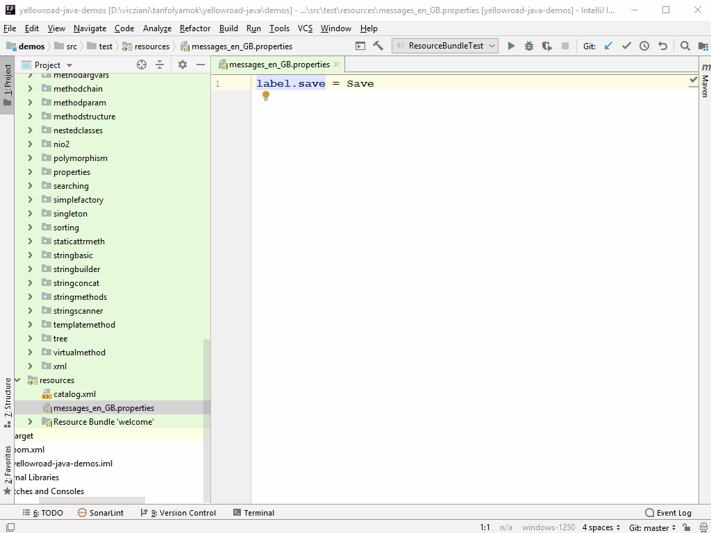

# Resource Bundle

A _Resource Bundle_-ök teszik lehetővé a többnyelvű alkalmazások fejlesztését azáltal,
hogy képesek az alkalmazásban megjelenő szövegeket különböző nyelveken tárolni,
és lekérdezhetővé tenni.
Ezek kulcs-érték párokat tartalmaznak nyelvenként. Nekünk lekérdezéskor a kulcsot
és a nyelvet kell megadni, és ennek hatására megkapjuk a kulcshoz és nyelvhez tartozó szöveget.

A `ResourceBundle` absztrakt osztály, melynek különböző leszármazottjai vannak.

A különböző nyelvi szövegeket javasolt properties állományokban tárolni. Ezek
egyszerű szöveges állományok, melyek a kulcs-érték párokat tartalmazzák. Nyelvenként
van egy properties állomány.

Ha ezeket az állományokat akarjuk betölteni, akkor a `ResourceBundle.getBundle()`
metódus kell használnunk. Ez a metódus a `ResourceBundle` osztály
`PropertyResourceBundle` leszármazottját fogja visszaadni, de erről nekünk
nem kell tudnunk.

[important]
Java 9 óta az alapértelmezett karakterkódolás nem ISO-8859-1, hanem
UTF-8!
[/important]

Az IDEA alapértelmezetten az operációs rendszer karakterkódolásával kódolja a
properties állományt, ezért át kell állítani UTF-8-ra!



#### Property file

A property fájl egy speciális formátumú szöveges állomány. Nézzük meg a `messages_en_US.properties` állományt:

```java
label.save=Save
```

Először a kulcs szerepel, majd az egyenlőség jel után a hozzá tartozó fordítás, (`=` helyett `:` is használható!).
Nézzük a `messages_hu_HU.properties` állományt, amely a magyar fordítást tartalmazza:

```java
label.save=Mentés
```

Az elválasztó jel körüli szóközöket nem veszi figyelembe.
A property fájlba megjegyzéseket is lehet írni a `#` vagy a `!` karakterek használatával.

### Property fájl beolvasása

A beolvasáshoz a `ResourceBundle` statikus `getBundle()` metódusát kell használnunk, melyben meg kell adni a base nevet majd egy `Locale` példányt.

```java
Locale locale = new Locale("hu", "HU");
ResourceBundle rb = ResourceBundle.getBundle("messages", locale);
System.out.println(rb.getString("label.save"));
```

Nézzük a property fájl elnevezési szabályait (fontos a sorrend!):

*	Base name (`messages.properties`)
*	Nyelv (`messages_hu.properties`)
*	Földrajzi hely (`messages_hu_HU.properties`)

A property fájl classpath-ról kerül betöltésre, de elhelyezhetjük csomagokba is, elválasztó karakter a pont. A Maven projektnél ezért az `src/main/resources` mappába kell helyeznünk.
Tehát ha úgy hivatkozunk rá, hogy `ResourceBundle.getBundle("messages", locale);`, akkor a `src/main/resources/messages.properties` állományból próbálja betölteni.
Ha a `ResourceBundle.getBundle("formatlocalebundle.messages", locale);` hívást használjuk, akkor a
`src/main/resources/formatlocalebundle/messages.properties` állományból próbálja betölteni.

#### Keresési algoritmus

Nézzük, hogyan történik a keresés kulcs és locale alapján. Először minél pontosabb egyezés alapján történik keresés, ahol stimmel a nyelv és az ország is, majd
egyre nagyobb az általánosítás. Ha a JVM nem találja a megfelelő locale-t akkor a default locale alapján keres. Ha úgy sem találja, akkor megpróbálja locale nélkül.
Ha nem találja sehogy sem akkor a `MissingResourceException` kivételt dobja.

Tehát például __magyar__ operációs rendszer esetén a `ResourceBundle.getBundle("messages", new Locale("en", "US"));` betöltési mód a következő keresést eredményezi:

* `messages_en_US.properties`
* `messages_en.properties`
* `messages_hu_HU.properties`
* `messages_hu.properties`
* `messages.properties`

## Ellenőrző kérdések

* Mire használjuk a resource bundle-t?
* Hogy épül fel egy properties állomány?
* Hogyan kell elnevezni a properties fájlokat?
* Hogyan lesz nyelv specifikusan kiválasztva a kívánt properties fájl?


## Gyakorlati feladat - szótár

Készítsünk egy szótárt, amely angolról németre és angolról magyarra fordít!
Az egyes nyelvek szavait properties fájlok tartalmazzák és a beolvasásuk funkció függő módon történik.

### Hibakezelés

Ha szótárunkban olyan szót keresnek, ami nincs benne, dobjon egy `IllegalArgumentException`-t

### Megvalósítás

publikus metódusok:
```java
public String englishToHungarian(String key)
public String englishToGerman(String key)
```

### Tippek

Magyar Locale konstans (`Locale.HUNGARIAN`) nincs a Javaban.
Ezért ebben az esetben nekünk kell létrehozni a `Locale` objektumot.
Amennyiben van megfelelő konstans, használjuk azt.

[rating feedback=java-formatlocalebundle-szotar]  
